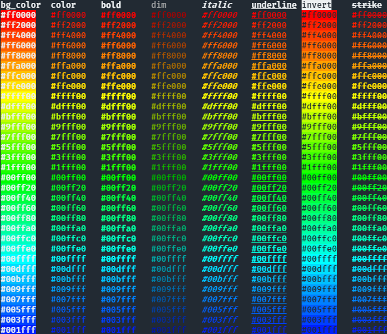
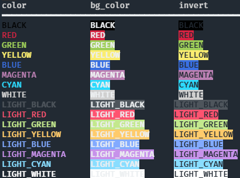

.. contents:: **tcolorpy**
   :backlinks: top
   :depth: 2

Summary
============================================
tcolopy is a Python library to apply true color for terminal text.

.. image:: https://badge.fury.io/py/tcolorpy.svg
    :target: https://badge.fury.io/py/tcolorpy
    :alt: PyPI package version

.. image:: https://img.shields.io/pypi/pyversions/tcolorpy.svg
    :target: https://pypi.org/project/tcolorpy
    :alt: Supported Python versions

.. image:: https://img.shields.io/pypi/implementation/tcolorpy.svg
    :target: https://pypi.org/project/tcolorpy
    :alt: Supported Python implementations

.. image:: https://img.shields.io/travis/thombashi/tcolorpy/master.svg?label=Linux/macOS%20CI
    :target: https://travis-ci.org/thombashi/tcolorpy
    :alt: Linux/macOS CI status

.. image:: https://img.shields.io/appveyor/ci/thombashi/tcolorpy/master.svg?label=Windows%20CI
    :target: https://ci.appveyor.com/project/thombashi/tcolorpy/branch/master
    :alt: Windows CI status

.. image:: https://coveralls.io/repos/github/thombashi/tcolorpy/badge.svg?branch=master
    :target: https://coveralls.io/github/thombashi/tcolorpy?branch=master
    :alt: Test coverage: coveralls

.. image:: https://codecov.io/gh/thombashi/tcolorpy/branch/master/graph/badge.svg
  :target: https://codecov.io/gh/thombashi/tcolorpy
    :alt: Test coverage: codecov

Usage
============================================

Library usage
--------------------------------------------

:Sample Code:
    .. code-block:: python

        from tcolorpy import tcolor

        print(tcolor("tcolopy example", color="#ee1177", styles=["bold", "italic", "underline"]))

:Output:
    .. figure:: ss/oneline.png
        :scale: 60%
        :alt: oneline

CLI usage
--------------------------------------------
You can also use ``tcolorpy`` via CLI:

::

    $ python -m tcolorpy "tcolopy example" -c "#ee1177" -s bold,italic,underline

Output examples
--------------------------------------------
Apply true color and styles to text:

You can also specify by color names:

Installation
============================================
::

    pip install tcolorpy

Dependencies
============================================
Python 3.5+
No external dependencies.
